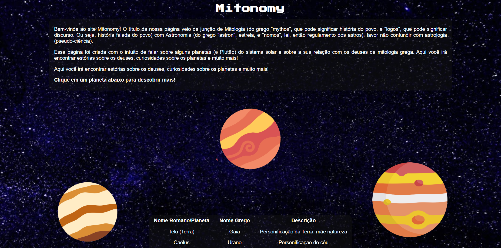
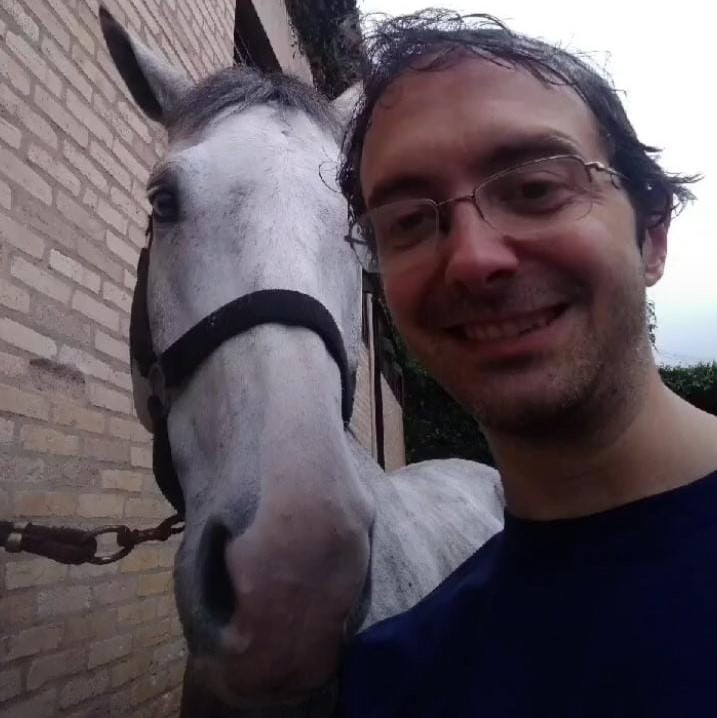

<h1 align="center" style="font-weight: bold;">Mitonomy 🪐</h1>

  
  
  

 <a href="#about">Sobre</a> • 
 <a href="#layout">Leiaute</a> • 
 

    <b>Um site simples sobre mitologia greco-romana e astronomia</b>

     <a href="https://alexbeldam.github.io/mitonomy/">📱 Visite o site</a>

---

<h2 id="layout">🖼️ Leiaute</h2>

    

<h2 id="about">📖 Sobre</h2>

Mitonomia é um site que explora os laços entre mitologia e astronomia, desenvolvido como projeto de estudo para a disciplina de Laboratório de Programação para Web.

O tema "mitonomia" representa a fusão entre mitologia e astronomia — duas áreas naturalmente conectadas. Desde a antiguidade, civilizações deram nomes mitológicos a constelações, planetas e fenômenos celestes, unindo ciência e narrativa em uma mesma tentativa de entender o universo. Este site apresenta de forma simples essa relação simbiótica entre os mitos greco-romanos e o céu que nos cerca.

<h2 id="colab">🤝 Colaboradores</h2>

Um grande obrigado a todas as pessoas que contribuíram para este projeto.

<table>
  <tr>
    <td align="center">
      <a href="https://github.com/alexbeldam">
         
        <b>Alex</b>
      </a>
    </td>
    <td align="center">
      <a href="https://github.com/FabiKelly">
         
        <b>Fabiana</b>
      </a>
    </td>
    <td align="center">
      <a href="https://github.com/Sugarylix">
         
        <b>Felix</b>
      </a>
    </td>
    <td align="center">
      <a href="https://github.com/Geovanac5643">
         
        <b>Geovana</b>
      </a>
    </td>
    <td align="center">
      <a href="https://github.com/julia-sg">
         
        <b>Júlia</b>
      </a>
    </td>
    <td align="center">
      <a href="https://github.com/marina-lopes">
         
        <b>Marina</b>
      </a>
    </td>
  </tr>
</table>

<h2 id="honra">⭐ Menção Honrosa</h2>

E um grande obrigado ao professor que nos ensinou tudo e mais um pouco!

<table>
  <tr>
    <td align="center">
      <a href="https://github.com/daniel-hasan">
         
        <b>Professor Hasan</b>
      </a>
    </td>
  </tr>
</table>

<h2 id="tp1">🖥️ Fiomoria</h2>

O trabalho feito antes deste pode ser encontrado nesse respositório: 
👉 **[https://github.com/alexbeldam/fiomoria](https://github.com/alexbeldam/fiomoria)**
